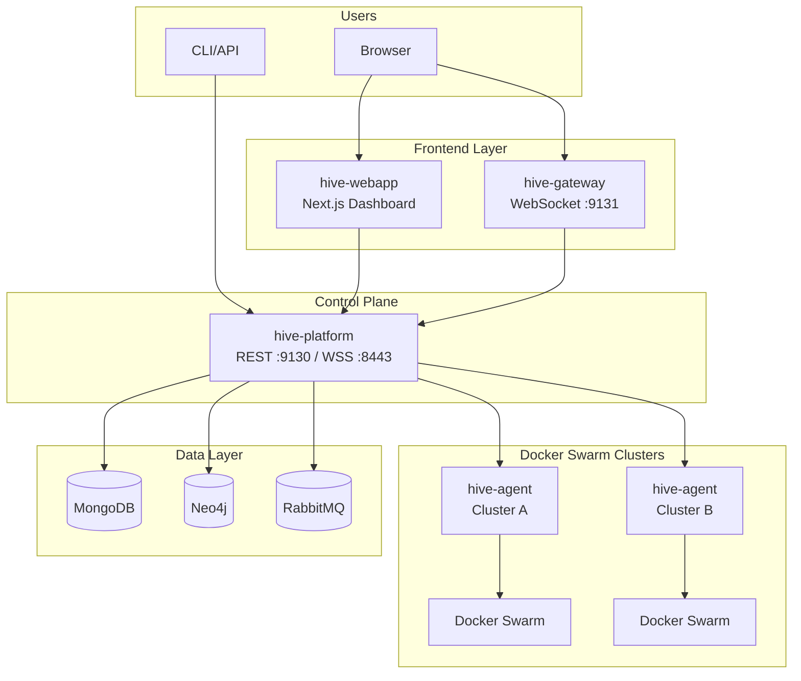

# HIVE Documentation

Comprehensive documentation for the HIVE multi-cluster Docker Swarm orchestration platform.

## Important: Docker Desktop is Not Supported for Swarm

HIVE relies on Docker Swarm overlay networking and real-time service discovery.
**Docker Desktop (Mac/Windows)** is not supported for Swarm because it frequently breaks:
- Overlay DNS/service discovery (containers cannot resolve service names).
- Swarm networking (VXLAN) and advertised addresses behind NAT.
- Agent metrics/state accuracy (nodes appear healthy while services are unreachable).

Use **Docker Engine on Linux** (bare metal or a Linux VM).
See: [Linux VM Setup Guide](guides/linux-vm.md)

## What is HIVE?

HIVE is a production-ready platform for managing Docker Swarm clusters at scale.

**The Stack:**
- **hive-platform** - Control plane (Java 21 / Spring Boot)
- **hive-agent** - Cluster agent (Go 1.24)
- **hive-gateway** - Real-time WebSocket gateway (Java / Spring Boot)
- **hive-webapp** - Dashboard (Next.js 15 / React 19)
- **hive-security-starter** - Shared auth library (Spring Security / Keycloak)

## Documentation

### Architecture
- [System Overview](architecture/overview.md) - How all the pieces fit together
- [Components](architecture/components.md) - What each component does
- [Agent Connection Flow](architecture/agent-connection.md) - How agents authenticate and communicate
- [Data Flow](architecture/data-flow.md) - How data moves through the system

### Environments
- [Development Setup](environments/development.md) - Single swarm, all-in-one
- [Production Setup](environments/production.md) - Dual swarm with network isolation
- [Dev vs Prod Comparison](environments/comparison.md) - Understanding the differences

### Infrastructure
- [VPN Setup](infrastructure/vpn-setup.md) - WireGuard mesh configuration
- [Docker Swarm Setup](infrastructure/swarm-setup.md) - Cluster deployment
- [Security Model](infrastructure/security.md) - Zero-trust architecture
- [Networking](infrastructure/networking.md) - Ports, protocols, firewall rules

### Guides
- [Getting Started](guides/getting-started.md) - Quick start for development
- [Production Deployment](guides/production-deployment.md) - Full production setup
- [Adding Clusters](guides/adding-clusters.md) - Scaling with new clusters
- [Configuration Reference](configuration-reference.md) - Environment variables by component

## Architecture at a Glance

## License

This documentation is licensed under [CC BY 4.0](../LICENSE).
