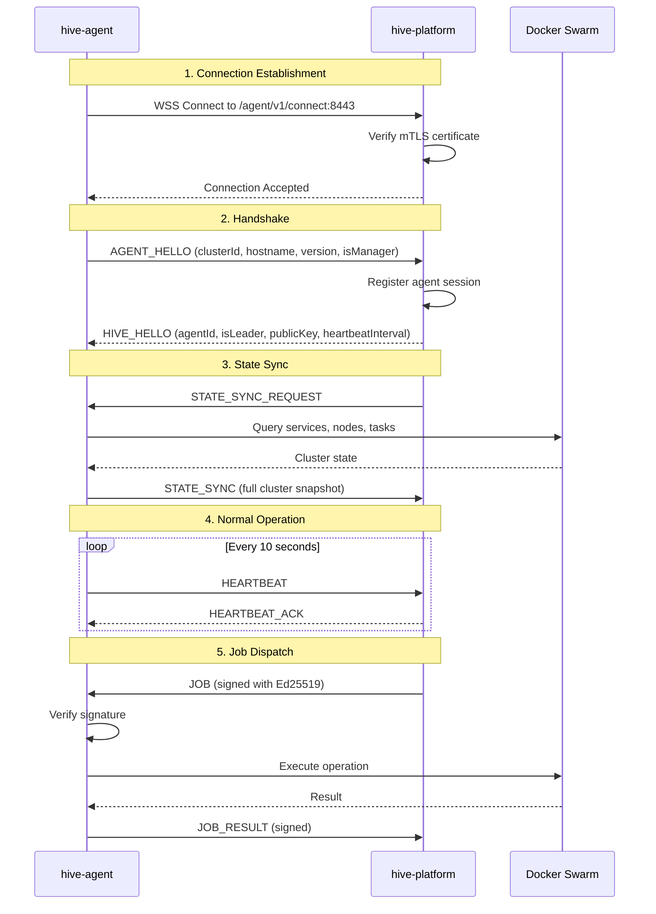

# Agent Connection Flow

## Overview

HIVE agents connect to the control plane via secure WebSocket. The connection is authenticated using mTLS certificates and messages are signed with Ed25519 for integrity verification.

## Connection Sequence



## Message Types

### Inbound (Agent → Platform)

| Type | Purpose | Signed |
|------|---------|--------|
| `AGENT_HELLO` | Initial handshake | No |
| `HEARTBEAT` | Keep connection alive | No |
| `STATE_SYNC` | Full cluster state snapshot | Yes |
| `STATE_DELTA` | Incremental state update | Yes |
| `DOCKER_EVENT` | Real-time Docker events | No |
| `JOB_RESULT` | Job execution result | Yes |
| `JOB_PROGRESS` | Job progress update | Yes |

### Outbound (Platform → Agent)

| Type | Purpose | Signed |
|------|---------|--------|
| `HIVE_HELLO` | Handshake response | No |
| `HEARTBEAT_ACK` | Heartbeat acknowledgment | No |
| `STATE_SYNC_REQUEST` | Request full state | No |
| `JOB` | Job to execute | Yes |
| `JOB_CANCEL` | Cancel running job | Yes |
| `CONFIG_UPDATE` | Configuration change | No |
| `LEADER_ELECTED` | Leadership notification | No |
| `ERROR` | Error response | No |

## AGENT_HELLO Message

```json
{
  "type": "AGENT_HELLO",
  "payload": {
    "clusterId": "cluster-abc123",
    "hostname": "swarm-manager-1",
    "version": "1.0.0",
    "isManager": true,
    "ipAddress": "10.0.0.5",
    "certificateFingerprint": "SHA256:abc123...",
    "capabilities": ["exec", "logs", "metrics"]
  },
  "timestamp": "2026-02-03T12:00:00Z"
}
```

## HIVE_HELLO Response

```json
{
  "type": "HIVE_HELLO",
  "payload": {
    "accepted": true,
    "agentId": "agent-xyz789",
    "isLeader": true,
    "heartbeatIntervalMs": 10000,
    "publicKey": "MCowBQYDK2VwAyEA...",
    "requestStateSync": true
  },
  "timestamp": "2026-02-03T12:00:01Z"
}
```

## Ed25519 Signature Verification

### Why Ed25519?
- Fast signature generation and verification
- Small key sizes (32 bytes)
- Immune to timing attacks
- No nonce required

### How It Works

1. **Platform signs jobs** before dispatch:
   ```
   signature = Ed25519.sign(privateKey, canonicalJson(payload))
   ```

2. **Agent verifies** before execution:
   ```
   valid = Ed25519.verify(publicKey, canonicalJson(payload), signature)
   ```

3. **Signature format**: Base64-encoded 64-byte signature

### Configuration

**Platform** (`application.yml`):
```yaml
hive:
  agent:
    signing:
      enabled: true
      privateKeyPath: /etc/hive/ed25519-private.pem
      publicKeyPath: /etc/hive/ed25519-public.pem
```

**Agent** (`config.yaml`):
```yaml
security:
  publicKey: "MCowBQYDK2VwAyEA..."  # Base64 public key from platform
```

## Reconnection Logic

The agent maintains a persistent connection with automatic reconnection:

| Scenario | Behavior |
|----------|----------|
| Connection lost | Reconnect with exponential backoff |
| Initial delay | 5 seconds |
| Max delay | 5 minutes |
| Backoff factor | 2x |
| Jitter | Yes (prevents thundering herd) |

```go
// Simplified reconnection logic
delay := initialDelay
for {
    err := connect()
    if err == nil {
        delay = initialDelay
        handleMessages()
    }
    time.Sleep(delay + randomJitter())
    delay = min(delay * 2, maxDelay)
}
```

## mTLS Configuration

For production deployments, agents authenticate with client certificates:

**Platform**:
```yaml
hive:
  agent:
    mtls:
      keystorePath: /etc/hive/server.p12
      keystorePassword: ${KEYSTORE_PASSWORD}
      truststorePath: /etc/hive/truststore.p12
      truststorePassword: ${TRUSTSTORE_PASSWORD}
      clientAuthRequired: true
```

**Agent**:
```yaml
controlPlane:
  tls:
    enabled: true
    certFile: /etc/hive/agent.crt
    keyFile: /etc/hive/agent.key
    caFile: /etc/hive/ca.crt
```

## See Also

- [Components](components.md) - Component responsibilities
- [Security Model](../infrastructure/security.md) - Zero-trust architecture
- [Production Setup](../environments/production.md) - Deployment guide
