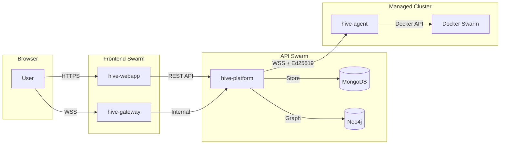
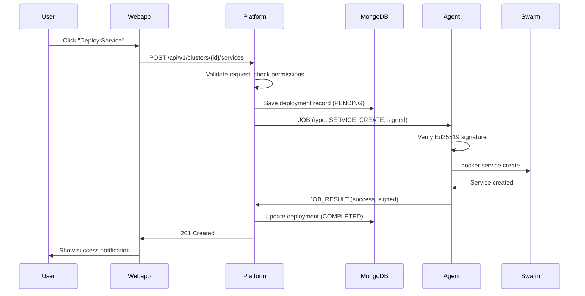
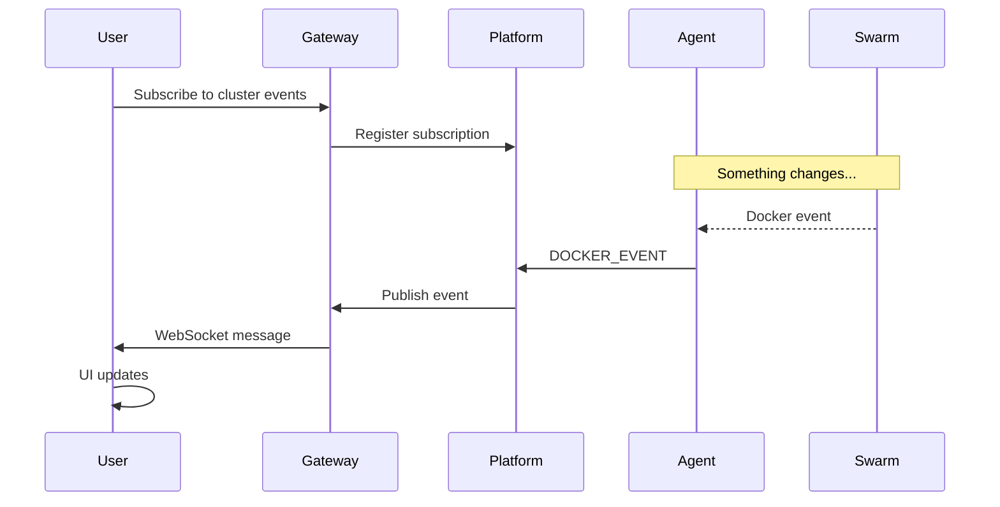
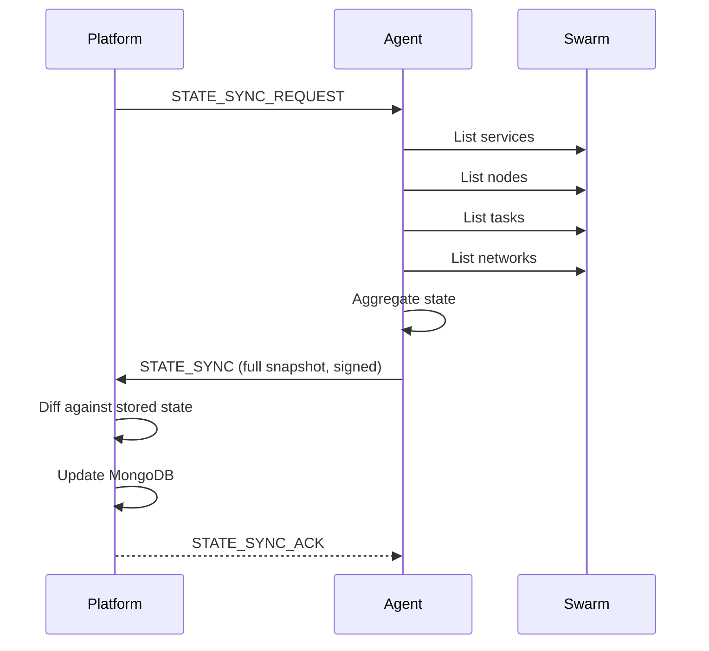
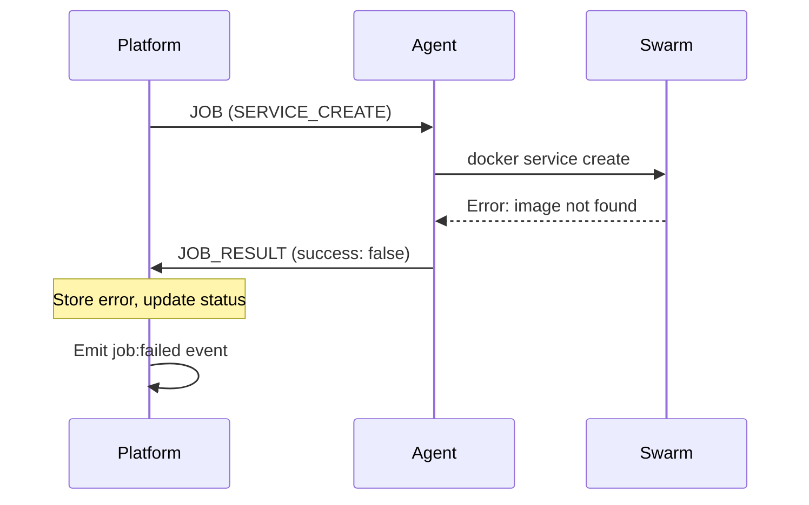
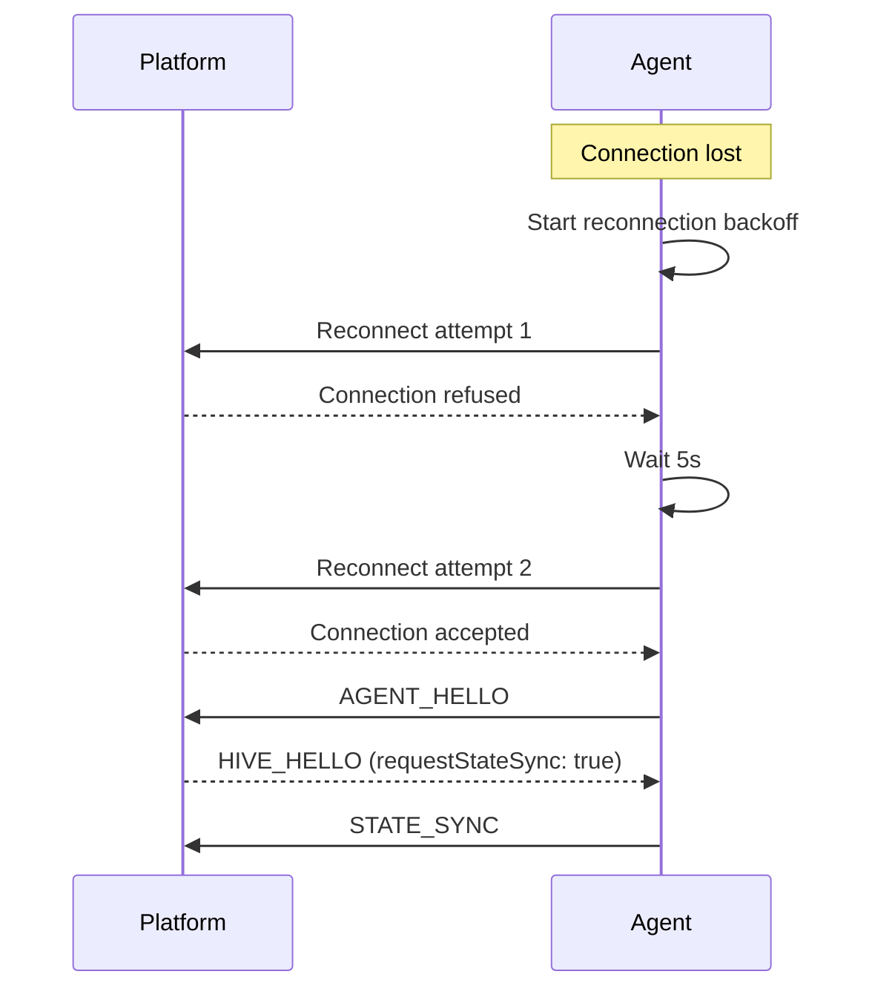

# Data Flow

## Overview

This document describes how data flows through the HIVE system, from user actions in the webapp to job execution on managed clusters.

## High-Level Data Flow



## User Actions Flow

### 1. Service Deployment

When a user deploys a service:



### 2. Real-Time Updates

Events flow back to users via the gateway:



### 3. State Synchronization

Agents periodically sync full cluster state:



## Data Storage

### MongoDB Collections

| Collection | Purpose | Key Fields |
|------------|---------|------------|
| `clusters` | Cluster metadata | id, name, status, agentId |
| `services` | Service definitions | clusterId, name, spec, state |
| `nodes` | Swarm nodes | clusterId, nodeId, role, status |
| `tasks` | Running tasks | clusterId, serviceId, state |
| `jobs` | Job history | clusterId, type, status, result |
| `events` | Audit log | timestamp, type, actor, details |

### Neo4j Graph

The dependency graph shows relationships:

```cypher
// Service dependencies
(service:Service)-[:DEPENDS_ON]->(dependency:Service)

// Services on nodes
(task:Task)-[:RUNS_ON]->(node:Node)

// Cluster containment
(service:Service)-[:BELONGS_TO]->(cluster:Cluster)
```

## Message Formats

### REST API (Webapp → Platform)

```json
// POST /api/v1/clusters/{clusterId}/services
{
  "name": "my-service",
  "image": "nginx:latest",
  "replicas": 3,
  "ports": [
    { "target": 80, "published": 8080 }
  ],
  "environment": {
    "NODE_ENV": "production"
  }
}
```

### WebSocket (Platform → Agent)

```json
{
  "type": "JOB",
  "payload": {
    "jobId": "job-123",
    "type": "SERVICE_CREATE",
    "spec": {
      "name": "my-service",
      "image": "nginx:latest",
      "replicas": 3
    }
  },
  "signature": "base64-ed25519-signature",
  "timestamp": "2026-02-03T12:00:00Z"
}
```

### WebSocket (Agent → Platform)

```json
{
  "type": "JOB_RESULT",
  "payload": {
    "jobId": "job-123",
    "success": true,
    "result": {
      "serviceId": "svc-abc123",
      "name": "my-service"
    }
  },
  "signature": "base64-ed25519-signature",
  "timestamp": "2026-02-03T12:00:05Z"
}
```

### WebSocket (Gateway → Browser)

Clients subscribe to topics using the 3-segment pattern:

```
/topic/{tenant}/{app}/{channel}
```

Example message delivered to subscribers:

```json
{
  "eventId": "evt-123",
  "type": "SERVICE_UPDATED",
  "payload": {
    "clusterId": "cluster-123",
    "resourceId": "svc-abc123",
    "serviceId": "svc-abc123",
    "serviceName": "my-service",
    "action": "SERVICE_UPDATED",
    "timestamp": "2026-02-03T12:00:10Z"
  },
  "tenantId": "hive",
  "app": "services",
  "channel": "activity",
  "publishedAt": "2026-02-03T12:00:10Z"
}
```

## Job Types

| Job Type | Direction | Purpose |
|----------|-----------|---------|
| `SERVICE_CREATE` | Platform → Agent | Create new service |
| `SERVICE_UPDATE` | Platform → Agent | Update service spec |
| `SERVICE_SCALE` | Platform → Agent | Change replica count |
| `SERVICE_DELETE` | Platform → Agent | Delete service |
| `SERVICE_ROLLBACK` | Platform → Agent | Rollback to previous |
| `SERVICE_FORCE_UPDATE` | Platform → Agent | Force redeploy |
| `SERVICE_LIST` | Platform → Agent | List services |
| `NODE_DRAIN` | Platform → Agent | Drain node for maintenance |
| `NODE_ACTIVATE` | Platform → Agent | Activate drained node |
| `NODE_LABEL` | Platform → Agent | Update node labels |
| `NODE_REMOVE` | Platform → Agent | Remove node |
| `TASK_EXEC` | Platform → Agent | Run command in task |
| `TASK_LIST` | Platform → Agent | List tasks |
| `TASK_GET` | Platform → Agent | Get task details |
| `GET_JOIN_TOKEN` | Platform → Agent | Swarm join token |
| `FORCE_STATE_SYNC` | Platform → Agent | Force state sync |
| `DNS_CREATE` | Platform → Agent | Create DNS record |
| `DNS_DELETE` | Platform → Agent | Delete DNS record |
| `DNS_SYNC` | Platform → Agent | Sync DNS records |
| `DNS_VALIDATE` | Platform → Agent | Validate DNS config |
| `SECRET_SYNC` | Platform → Agent | Sync secrets |
| `SECRET_CREATE` | Platform → Agent | Create secret |
| `SECRET_DELETE` | Platform → Agent | Delete secret |
| `SERVICE_GET_LOGS` | Platform → Agent | Fetch service logs |
| `SERVICE_INSPECT` | Platform → Agent | Inspect service |
| `CONFIG_CREATE` | Platform → Agent | Create config |
| `CONFIG_DELETE` | Platform → Agent | Delete config |
| `CONFIG_LIST` | Platform → Agent | List configs |
| `CONFIG_INSPECT` | Platform → Agent | Inspect config |
| `VOLUME_CREATE` | Platform → Agent | Create volume |
| `VOLUME_DELETE` | Platform → Agent | Delete volume |
| `VOLUME_LIST` | Platform → Agent | List volumes |
| `VOLUME_INSPECT` | Platform → Agent | Inspect volume |

## Event Types

### Docker Events (Agent → Platform)

| Event | When |
|-------|------|
| `container.start` | Container starts |
| `container.stop` | Container stops |
| `container.die` | Container exits |
| `service.create` | Service created |
| `service.update` | Service updated |
| `service.remove` | Service deleted |
| `node.update` | Node status changes |

### Platform Events (Gateway → Browser)

| Event | Channel | When |
|-------|---------|------|
| `cluster:connected` | `cluster:{id}` | Agent connects |
| `cluster:disconnected` | `cluster:{id}` | Agent disconnects |
| `service:created` | `cluster:{id}` | Service created |
| `service:updated` | `cluster:{id}` | Service updated |
| `task:state` | `service:{id}` | Task state changes |
| `job:progress` | `job:{id}` | Job progress update |

## Error Handling

### Job Failures



### Connection Loss



## Performance Considerations

### Caching

- Platform caches JWT validation keys (JWKS)
- Agent caches Docker state between syncs
- Webapp uses React Query for API response caching

### Batching

- State sync sends complete snapshot (not individual updates)
- Docker events are debounced before sending
- Bulk operations are supported for services

### Compression

- WebSocket messages are compressed (permessage-deflate)
- Large state syncs use binary encoding

## See Also

- [Components](components.md) - Component responsibilities
- [Agent Connection](agent-connection.md) - WebSocket protocol details
- [Networking](../infrastructure/networking.md) - Network topology
