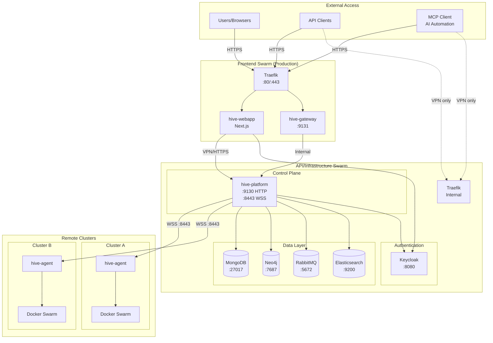

# HIVE System Architecture

## Overview

HIVE is a multi-cluster Docker Swarm orchestration platform. It enables centralized management of distributed container workloads across multiple data centers or cloud regions.

## System Diagram



Dashed lines indicate optional VPN-only access (if you choose not to expose the API publicly).

## Component Responsibilities

| Component | Port(s) | Responsibility |
|-----------|---------|----------------|
| **hive-platform** | 9130 (HTTP), 8443 (WSS) | Central control plane - cluster registration, job dispatch, state management |
| **hive-agent** | 9190 (metrics) | Runs on each Swarm manager - executes jobs, reports state, manages Docker |
| **hive-gateway** | 9131 | Real-time event delivery to browsers via WebSocket |
| **hive-webapp** | 80/443 (via Traefik) | Dashboard UI for cluster management |
| **hive-security-starter** | N/A (library) | Shared JWT/Keycloak authentication |

## Communication Patterns

### Agent → Platform
- **Protocol**: WebSocket Secure (WSS)
- **Endpoint**: `/agent/v1/connect` on port 8443
- **Authentication**: mTLS + Ed25519 message signatures
- **Heartbeat**: Every 10 seconds

### Platform → Agent
- **Jobs**: Dispatched via WebSocket
- **Types**: SERVICE_CREATE, SERVICE_UPDATE, SERVICE_SCALE, SERVICE_DELETE, etc.
- **Signed**: All jobs signed with Ed25519 for verification

### Webapp → Platform
- **Protocol**: HTTPS REST API
- **Authentication**: JWT (via Keycloak)
- **Tenant Isolation**: Claims-based (tenant, org from token)

### Gateway → Browsers
- **Protocol**: WebSocket (WS/WSS)
- **Purpose**: Real-time updates (deployments, events, logs)
- **Authentication**: JWT or API key

## Network Topology

### Development (Single Swarm)
```
┌─────────────────────────────────────────────┐
│              Docker Swarm                    │
│  ┌─────────┐ ┌─────────┐ ┌─────────┐       │
│  │ webapp  │ │platform │ │ agent   │       │
│  │         │ │         │ │         │       │
│  │  :3000  │ │:9130    │ │         │       │
│  │         │ │:8443    │ │         │       │
│  └────┬────┘ └────┬────┘ └────┬────┘       │
│       │           │           │             │
│       └───────────┼───────────┘             │
│                   │                         │
│            overlay network                  │
└─────────────────────────────────────────────┘
```

### Production (Dual Swarm)
```
┌─────────────────────────────────────────────────────────────────────┐
│                         WireGuard VPN (10.0.0.0/24)                 │
│                                                                      │
│  ┌─────────────────────┐              ┌─────────────────────┐       │
│  │   Frontend Swarm    │              │    API/Infra Swarm  │       │
│  │   (10.0.0.20-22)    │              │    (10.0.0.1-12)    │       │
│  │                     │              │                     │       │
│  │  ┌───────────────┐  │    HTTPS    │  ┌───────────────┐  │       │
│  │  │    webapp     │──┼─────────────┼──│   platform    │  │       │
│  │  │   gateway     │  │     443     │  │   databases   │  │       │
│  │  └───────────────┘  │              │  │   keycloak    │  │       │
│  │         │           │              │  └───────────────┘  │       │
│  │    Public :80/443   │              │    VPN only         │       │
│  └─────────┼───────────┘              └─────────────────────┘       │
│            │                                                         │
└────────────┼─────────────────────────────────────────────────────────┘
             │
        Internet
```

## Data Flow

1. **User deploys a service** via webapp
2. Webapp sends REST request to **platform** (via VPN in production)
3. Platform creates a **Job** and signs it with Ed25519
4. Platform dispatches job to **agent** via WebSocket
5. Agent executes job on **Docker Swarm**
6. Agent reports **job result** back to platform
7. Platform updates state and notifies **gateway**
8. Gateway pushes real-time update to **webapp**

## See Also

- [Components](components.md) - Detailed component descriptions
- [Agent Connection Flow](agent-connection.md) - Authentication details
- [Production Setup](../environments/production.md) - Dual swarm deployment
