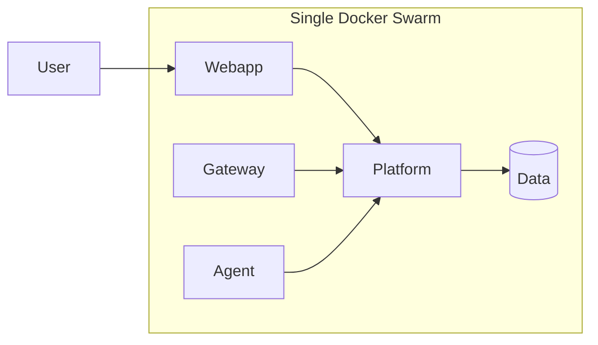
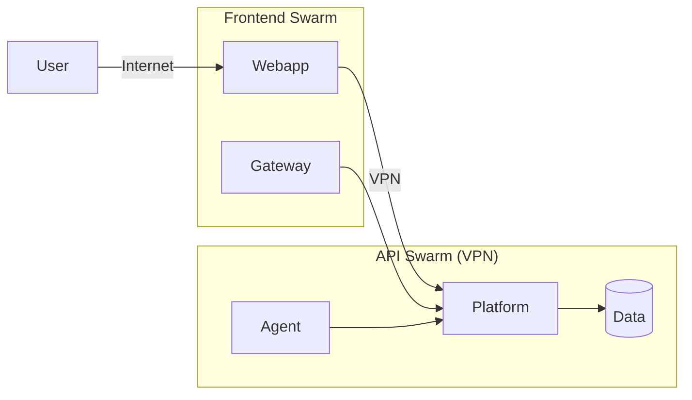

# Development vs Production Comparison

## Side-by-Side Architecture

### Development


### Production


## Key Differences

| Aspect | Development | Production |
|--------|-------------|------------|
| **Clusters** | 1 swarm | 2+ swarms |
| **Network** | Single overlay | VPN + overlays |
| **Public exposure** | All services | Only frontend (80/443) |
| **Database access** | Direct | Via overlay only |
| **TLS** | Optional (HTTP OK) | Required everywhere |
| **Agent auth** | Basic | mTLS + Ed25519 |
| **High availability** | None | 3+ managers per swarm |
| **Data replication** | Single node | Replica sets |
| **Secrets** | Environment vars | Docker secrets + Vault |
| **Monitoring** | Basic logs | Full observability stack |

## Why Separation Matters

### Security
- **Attack surface**: Only 80/443 exposed to internet
- **Blast radius**: Compromised frontend can't reach databases directly
- **Credential isolation**: Database passwords never on frontend servers

### Scalability
- **Independent scaling**: Scale frontend for traffic, API for processing
- **Resource isolation**: Data-heavy workloads don't compete with web serving
- **Geographic distribution**: Frontend close to users, API centralized

### Compliance
- **Network segmentation**: Required for many compliance frameworks
- **Audit trail**: Clear separation of duties
- **Data residency**: Control where data lives

## Migration Path

### From Development to Production

1. **Set up VPN mesh** between all servers
   - See [VPN Setup Guide](../infrastructure/vpn-setup.md)

2. **Deploy API Swarm** (existing dev becomes this)
   - Add manager nodes for HA
   - Move data services to dedicated workers

3. **Deploy Frontend Swarm**
   - New cluster for public-facing services
   - Configure Traefik with TLS

4. **Update webapp configuration**
   - Point to API via VPN address
   - Update environment variables

5. **Enable mTLS** for agent connections
   - Generate certificates
   - Configure platform and agents

6. **Set up monitoring**
   - Deploy Prometheus, Grafana
   - Configure alerting

## Configuration Differences

### Webapp Environment

**Development:**
```bash
NEXT_PUBLIC_API_BASE_URL=http://localhost:9130
NEXT_PUBLIC_REALTIME_WS_URL=ws://localhost:9131/ws
KEYCLOAK_URL=http://localhost:8080
```

**Production:**
```bash
NEXT_PUBLIC_API_BASE_URL=https://api.example.com
NEXT_PUBLIC_REALTIME_WS_URL=wss://ws.example.com/ws
KEYCLOAK_URL=https://auth.example.com
```

### Platform Configuration

**Development (`application-dev.yml`):**
```yaml
server:
  port: 9130

spring:
  data:
    mongodb:
      uri: mongodb://localhost:27017/hive

hive:
  agent:
    signing:
      enabled: false  # Simplified for dev
```

**Production (`application-prod.yml`):**
```yaml
server:
  port: 9130
  ssl:
    enabled: true

spring:
  data:
    mongodb:
      uri: ${MONGODB_URI}  # From secrets

hive:
  agent:
    signing:
      enabled: true
      privateKeyPath: /etc/hive/keys/private.pem
    mtls:
      enabled: true
      clientAuthRequired: true
```

### Agent Configuration

**Development:**
```yaml
controlPlane:
  url: wss://localhost:8443/agent/v1/connect
  tls:
    enabled: false

security:
  publicKey: ""  # Verification disabled
```

**Production:**
```yaml
controlPlane:
  url: wss://api.internal.example.com:8443/agent/v1/connect
  tls:
    enabled: true
    certFile: /etc/hive/agent.crt
    keyFile: /etc/hive/agent.key
    caFile: /etc/hive/ca.crt

security:
  publicKey: "MCowBQYDK2VwAyEA..."  # Platform's Ed25519 public key
```

## Common Mistakes

### 1. Exposing database ports to frontend swarm
**Wrong**: Adding MongoDB to frontend swarm's network
**Right**: Keep databases on API swarm overlay only

### 2. Using HTTP in production
**Wrong**: `API_URL=http://api.example.com`
**Right**: `API_URL=https://api.example.com` with valid TLS

### 3. Skipping mTLS for agents
**Wrong**: Trusting any WebSocket connection
**Right**: Require client certificates for agent connections

### 4. Single manager nodes
**Wrong**: 1 manager per swarm
**Right**: 3+ managers for quorum-based failover

## See Also

- [Development Setup](development.md) - Quick start guide
- [Production Setup](production.md) - Full deployment guide
- [Security Model](../infrastructure/security.md) - Zero-trust architecture
