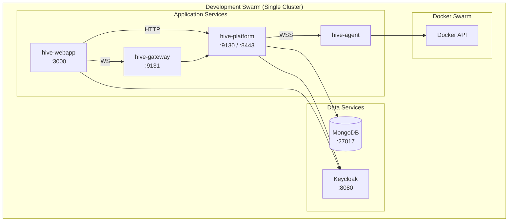

# Development Environment

## Overview

The development environment runs everything on a single Docker Swarm cluster for simplicity. All services communicate over a shared overlay network.

## Architecture



## Quick Start

### Prerequisites
- Docker Engine on Linux with Swarm mode enabled  
  (Docker Desktop is **not** supported for Swarm/overlay networking. Use a Linux host or Linux VM.)
- 8GB RAM minimum
- Ports available: 3000, 9131, 8080, 8443, 9130, 27017

Why not Docker Desktop? It commonly breaks Swarm overlay DNS, advertises the wrong IP behind NAT,
and causes agents to report stale or incorrect state.  
See: [Linux VM Setup Guide](../guides/linux-vm.md)

### 1. Initialize Swarm
```bash
docker swarm init
```

### 2. Create Overlay Network
```bash
docker network create --driver overlay --attachable hive-network
```

### 3. Start Data Services
```bash
# MongoDB
docker service create \
  --name mongodb \
  --network hive-network \
  -p 27017:27017 \
  mongo:7

# Keycloak
docker service create \
  --name keycloak \
  --network hive-network \
  -p 8080:8080 \
  -e KEYCLOAK_ADMIN=admin \
  -e KEYCLOAK_ADMIN_PASSWORD=admin \
  quay.io/keycloak/keycloak:24.0 start-dev
```

### 4. Start HIVE Services
```bash
# Platform
docker service create \
  --name hive-platform \
  --network hive-network \
  -p 9130:9130 \
  -p 8443:8443 \
  -e MONGODB_URI=mongodb://mongodb:27017/hive \
  -e KEYCLOAK_AUTH_SERVER_URL=http://keycloak:8080 \
  ghcr.io/ostec-io/hive-platform:latest

# Agent (connect to local swarm)
docker service create \
  --name hive-agent \
  --network hive-network \
  --mount type=bind,source=/var/run/docker.sock,target=/var/run/docker.sock \
  -e HIVE_CONTROL_PLANE_URL=ws://hive-platform:8443/agent/v1/connect \
  ghcr.io/ostec-io/hive-agent:latest

# Gateway
docker service create \
  --name hive-gateway \
  --network hive-network \
  -p 9131:9131 \
  ghcr.io/ostec-io/hive-gateway:latest

# Webapp
docker service create \
  --name hive-webapp \
  --network hive-network \
  -p 3000:3000 \
  -e NEXT_PUBLIC_API_BASE_URL=http://localhost:9130 \
  -e NEXT_PUBLIC_REALTIME_WS_URL=ws://localhost:9131/ws \
  -e KEYCLOAK_URL=http://localhost:8080 \
  -e KEYCLOAK_REALM=hive \
  -e KEYCLOAK_CLIENT_ID=hive-webapp \
  -e KEYCLOAK_CLIENT_SECRET=dev-secret \
  ghcr.io/ostec-io/hive-webapp:latest
```

### 5. Access the Dashboard
Open http://localhost:3000 in your browser.

## Docker Compose Alternative

For even simpler local development, use Docker Compose:

```yaml
# docker-compose.yml
version: '3.8'

services:
  mongodb:
    image: mongo:7
    ports:
      - "27017:27017"
    volumes:
      - mongodb_data:/data/db

  keycloak:
    image: quay.io/keycloak/keycloak:24.0
    ports:
      - "8080:8080"
    environment:
      - KEYCLOAK_ADMIN=admin
      - KEYCLOAK_ADMIN_PASSWORD=admin
    command: start-dev

  platform:
    image: ghcr.io/ostec-io/hive-platform:latest
    ports:
      - "9130:9130"
      - "8443:8443"
    environment:
      - MONGODB_URI=mongodb://mongodb:27017/hive
      - KEYCLOAK_AUTH_SERVER_URL=http://keycloak:8080
    depends_on:
      - mongodb
      - keycloak

  agent:
    image: ghcr.io/ostec-io/hive-agent:latest
    volumes:
      - /var/run/docker.sock:/var/run/docker.sock
    environment:
      - HIVE_CONTROL_PLANE_URL=wss://platform:8443/agent/v1/connect

  gateway:
    image: ghcr.io/ostec-io/hive-gateway:latest
    ports:
      - "9131:9131"

  webapp:
    image: ghcr.io/ostec-io/hive-webapp:latest
    ports:
      - "3000:3000"
    environment:
      - NEXT_PUBLIC_API_BASE_URL=http://localhost:9130
      - NEXT_PUBLIC_REALTIME_WS_URL=ws://localhost:9131/ws
      - KEYCLOAK_URL=http://localhost:8080
      - KEYCLOAK_REALM=hive
      - KEYCLOAK_CLIENT_ID=hive-webapp
      - KEYCLOAK_CLIENT_SECRET=dev-secret

volumes:
  mongodb_data:
```

Run with:
```bash
docker-compose up -d
```

## Key Differences from Production

| Aspect | Development | Production |
|--------|-------------|------------|
| Swarm clusters | 1 (single) | 2+ (frontend + API) |
| Network isolation | All on one network | VPN-separated |
| TLS | Optional | Required everywhere |
| Agent auth | Simplified | mTLS + Ed25519 |
| Data persistence | Local volumes | Replicated storage |
| High availability | None | 3+ managers per swarm |

## Troubleshooting

### Agent not connecting
1. Check platform is running: `docker service logs hive-platform`
2. Verify network connectivity: `docker exec -it <agent-container> ping hive-platform`
3. Check WebSocket port: `wscat -c ws://localhost:8443/agent/v1/connect`  
   If you’ve configured TLS/mTLS on the control plane, use `wss://` instead.

### Webapp shows "API unreachable"
1. Verify platform health: `curl http://localhost:9130/actuator/health`
2. Check CORS settings if running webapp from source
3. Ensure environment variables point to correct URLs

## See Also

- [Production Setup](production.md) - Multi-swarm deployment
- [Comparison](comparison.md) - Dev vs Prod differences
