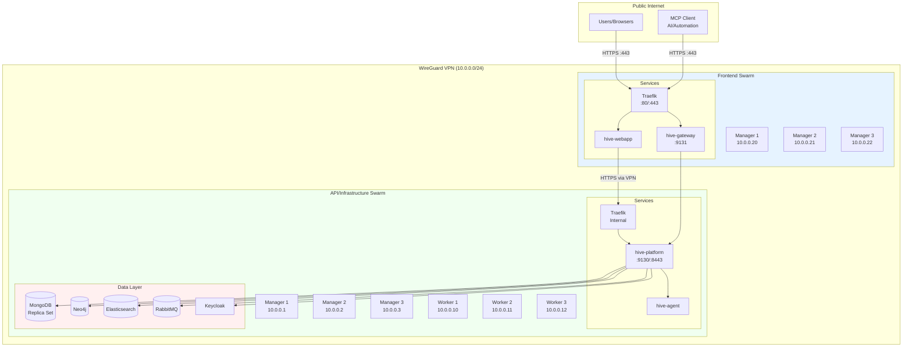

# Production Environment

## Overview

Production uses a **dual-swarm architecture** for security and isolation:
- **Frontend Swarm**: Public-facing, handles user traffic (80/443)
- **API/Infrastructure Swarm**: VPN-only, runs control plane and databases

This separation ensures databases are never exposed to the internet, even indirectly.

## Architecture



### MCP Access (Control Plane API)

MCP clients talk to the **control plane API** over HTTPS (same endpoint used by the webapp).
In production this is typically routed:

`MCP client → Frontend Traefik → API Traefik → hive-platform`

You can expose the API publicly (for MCP access) or keep it VPN‑only. In either case, MCP
calls are authenticated (API key / JWT, depending on your configuration).

## Network Layout

### VPN IP Allocation

| Range | Purpose |
|-------|---------|
| 10.0.0.1-3 | API Swarm managers (infrastructure) |
| 10.0.0.5-9 | Admin clients (laptops, CI/CD) |
| 10.0.0.10-19 | API Swarm workers |
| 10.0.0.20-29 | Frontend Swarm managers |

### Firewall Rules

**Frontend Servers (Public-Facing)**
| Port | Protocol | Source | Purpose |
|------|----------|--------|---------|
| 22 | TCP | Admin IPs | SSH |
| 80 | TCP | 0.0.0.0/0 | HTTP redirect |
| 443 | TCP | 0.0.0.0/0 | HTTPS |
| 51820 | UDP | VPN peers | WireGuard |
| 2377 | TCP | VPN (10.0.0.0/24) | Swarm management |
| 7946 | TCP/UDP | VPN | Swarm discovery |
| 4789 | UDP | VPN | Overlay network |

**API Servers (VPN-Only)**
| Port | Protocol | Source | Purpose |
|------|----------|--------|---------|
| 22 | TCP | VPN | SSH |
| 51820 | UDP | VPN peers | WireGuard |
| 2377 | TCP | VPN | Swarm management |
| 7946 | TCP/UDP | VPN | Swarm discovery |
| 4789 | UDP | VPN | Overlay network |
| 9130 | TCP | VPN | Platform API |
| 8443 | TCP | VPN | Agent WebSocket |

## Deployment Steps

### Prerequisites
- 6+ servers (3 frontend, 3+ API/infra)
- Docker Engine on Linux (Docker Desktop is **not** supported for Swarm/overlay networking)
- WireGuard VPN configured ([VPN Setup Guide](../infrastructure/vpn-setup.md))
- Domain with DNS configured
- TLS certificates (Let's Encrypt or similar)

### 1. Initialize API Swarm
```bash
# On API Manager 1 (10.0.0.1)
docker swarm init --advertise-addr 10.0.0.1

# Get join tokens
docker swarm join-token manager
docker swarm join-token worker

# On API Managers 2-3
docker swarm join --token <MANAGER_TOKEN> 10.0.0.1:2377

# On API Workers 1-3
docker swarm join --token <WORKER_TOKEN> 10.0.0.1:2377
```

### 2. Initialize Frontend Swarm
```bash
# On Frontend Manager 1 (10.0.0.20)
docker swarm init --advertise-addr 10.0.0.20

# On Frontend Managers 2-3
docker swarm join --token <FRONTEND_MANAGER_TOKEN> 10.0.0.20:2377
```

### 3. Deploy Data Services (API Swarm)
See [Swarm Setup Guide](../infrastructure/swarm-setup.md) for full stack deployment.

Key services:
- MongoDB (3-node replica set)
- Keycloak (2 instances + PostgreSQL)
- Neo4j (single node or cluster)
- Elasticsearch (3-node cluster)
- RabbitMQ (3-node cluster)

### 4. Deploy HIVE Platform (API Swarm)
```yaml
# hive-platform-stack.yml
version: '3.8'

services:
  platform:
    image: ghcr.io/ostec-io/hive-platform:<version>
    deploy:
      replicas: 2
      placement:
        constraints:
          - node.role == manager
    ports:
      - "9130:9130"
      - "8443:8443"
    environment:
      - SPRING_PROFILES_ACTIVE=prod
      - MONGODB_URI=${MONGODB_URI}
      - KEYCLOAK_AUTH_SERVER_URL=http://keycloak:8080
    networks:
      - hive-internal

  agent:
    image: ghcr.io/ostec-io/hive-agent:<version>
    deploy:
      mode: global
      placement:
        constraints:
          - node.platform.os == linux
    volumes:
      - /var/run/docker.sock:/var/run/docker.sock
    environment:
      - HIVE_CONTROL_PLANE_URL=wss://platform:8443/agent/v1/connect
    networks:
      - hive-internal

networks:
  hive-internal:
    driver: overlay
```

### 5. Deploy Frontend Services (Frontend Swarm)
```yaml
# hive-frontend-stack.yml
version: '3.8'

services:
  traefik:
    image: traefik:v3.0
    deploy:
      placement:
        constraints:
          - node.role == manager
    ports:
      - "80:80"
      - "443:443"
    volumes:
      - /var/run/docker.sock:/var/run/docker.sock
      - ./traefik.yml:/etc/traefik/traefik.yml
      - ./certs:/certs

  webapp:
    image: ghcr.io/ostec-io/hive-webapp:<version>
    deploy:
      replicas: 2
    environment:
      - NEXT_PUBLIC_API_BASE_URL=https://api.example.com
      - NEXT_PUBLIC_REALTIME_WS_URL=wss://ws.example.com/ws
      - KEYCLOAK_URL=https://auth.example.com
      - KEYCLOAK_REALM=hive
      - KEYCLOAK_CLIENT_ID=hive-webapp
      - KEYCLOAK_CLIENT_SECRET=${KEYCLOAK_CLIENT_SECRET}
    labels:
      - "traefik.enable=true"
      - "traefik.http.routers.webapp.rule=Host(`app.example.com`)"

  gateway:
    image: ghcr.io/ostec-io/hive-gateway:<version>
    deploy:
      replicas: 2
    labels:
      - "traefik.enable=true"
      - "traefik.http.routers.gateway.rule=Host(`ws.example.com`)"
```

## How Webapp Reaches Backend

In production, the webapp on the Frontend Swarm communicates with the platform on the API Swarm via the VPN:

1. **Browser** → HTTPS → **Traefik (Frontend)** → **Webapp**
2. **Webapp (SSR)** → HTTPS via VPN → **Traefik (API)** → **Platform**

The frontend servers have VPN connectivity to the API servers, but no database ports are exposed to the frontend swarm.

## Security Principles

1. **Defense in Depth**: Multiple layers of isolation
2. **Least Privilege**: Each swarm only has access to what it needs
3. **Zero Trust**: Even VPN traffic is authenticated/encrypted at the application layer
4. **Database Isolation**: Data stores only accessible via overlay network within API swarm

## Monitoring

- **Prometheus**: Scrapes metrics from all services
- **Grafana**: Dashboards for cluster health
- **Elasticsearch + Kibana**: Log aggregation
- **Neo4j**: Dependency graph visualization

## See Also

- [VPN Setup](../infrastructure/vpn-setup.md) - WireGuard configuration
- [Swarm Setup](../infrastructure/swarm-setup.md) - Data services deployment
- [Security Model](../infrastructure/security.md) - Zero-trust architecture
- [Comparison](comparison.md) - Dev vs Prod differences
